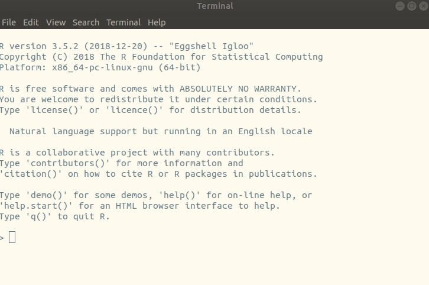

---
# Please do not edit this file directly; it is auto generated.
# Instead, please edit 00-prequel.md in _episodes_rmd/
title: "Before we begin"
author: "Greg Tucker-Kellogg"
date: "January 21, 2019"
output: html_document
teaching: 10
exercises: 0
questions:
  - a first question
objectives:
- "Understand and describe two ways of using R interactively: The R console and RStudio"
- "Learn how to create an R project in RStudio"
- "Be able to use the basic R help system in R and RStudio"
keypoints:
  - a key point
---

## The R Console

Try running R from either an open shell window (type `R`) or from the window launcher. In either case, you should wind up at a console window that looks like this

This is your basic R interface, provided by the language itself. There is a prompt, but it's no longer the bash prompt, it's the R prompt. When R starts, it tells you what version of the R program is running and what kind of hardware you are using to run it.

R can be a calculator: you can get output just by typing some math at the console, like this:

~~~
# This is some R input. A line that begins with # is a comment
22/7
~~~
{: .language-r}

~~~
[1] 3.142857
~~~
{: .output}

~~~
# it's silly to estimate the value of pi as a fraction; it's already defined
pi
~~~
{: .language-r}

~~~
[1] 3.141593
~~~
{: .output}

In these episodes, we can distinguish the input (what you type at the console) from what the R language returns by the color coding on the left.
