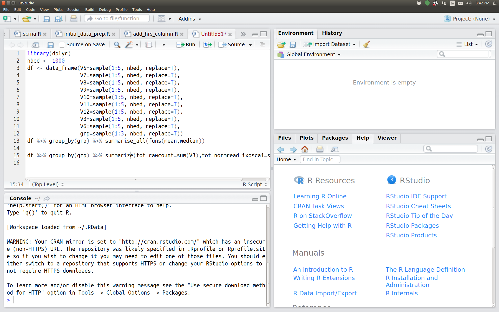

## What is R 

[**R**](https://www.r-project.org) is a high-level programming language that is extensively used by
statisticians and bioinformaticians. While R is a general purpose
programming language, R is designed to work with data, and is heavily used
in the *data science* community.

Additionally, R is an *interpreted* language, which means that code written in R
will be executed by a command interpreter instead of requiring compilation (as is the case
with compiled languages such as **C** or **Java**). Interpreted languages are especially
convenient for real-time problem solving and rapid prototyping.

Use of R has increased substantially over the last few years in large part due to the
growth in data intensive fields and data science. Hence, knowing how to work in R is
becoming increasingly important, and will be the main language we will work in for
analysis of genomic data.

## Why R

Various features of R makes it attractive for data analysis. These includes the following:

1. R is open-source, which means both that algorithms and methods can be checked for
   validity, and that users of R contribute to the code base and development of new
   packages.
1. R runs on all major computer platforms.
2. R can be extended using *packages*.
4. R is free software (as in free speech, not free beer), available under the [GNU General Public
   License][GPL] version 2 or greater.  R packages may be distributed under different
   license terms.
5. R has outstanding graphics and data visualisation capabilities, supporting publication
   quality graphs/figures.
6. R has an active community of users and developers, which facilitates the ease of
   getting help from others.

## Disadvantages of R

Life is full of tradeoffs, and not everything about R is an unambiguous advantage over
other choices.

- Code written in R runs much slower than code written in C or Java. (However, writing
  code usually takes much longer than running it, so this is often not a concern).
- R has a somewhat quirky language syntax, and is sometimes seen as an inconsistent
  language. R is often accused of violating the [Principle of least astonishment](https://en.wikipedia.org/wiki/Principle_of_least_astonishment).
  
  

## R and RStudio

R is the language and interpreter, whereas [RStudio][RStudio] is a professional
development environment that includes a code editor, debugging tools, and a server
available from a browser. A screenshot of the RStudio interface is shown below. We
encourage the use of RStudio as an interface to R.

[GPL]: https://www.r-project.org/Licenses/
[RStudio]: https://www.rstudio.com/
