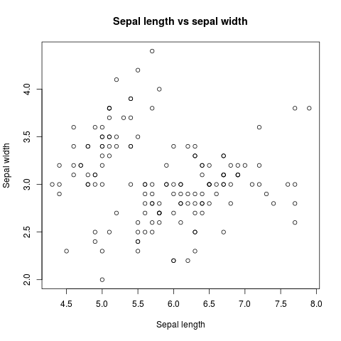

# Visualization of data in R
One of the key strengths of R is its ability to generate publication quality graphics easily. In this section, we will introduce the `plot()` function, which provides a quick method to plot data. We will refer to the *iris* dataset for the rest of this section.  

## Plotting data using `plot()`
From the usage manual

~~~
Description:

     Generic function for plotting of R objects.  For more details
     about the graphical parameter arguments, see ‘par’.

     For simple scatter plots, ‘plot.default’ will be used.  However,
     there are ‘plot’ methods for many R objects, including
     ‘function’s, ‘data.frame’s, ‘density’ objects, etc.  Use
     ‘methods(plot)’ and the documentation for these.

Usage:

     plot(x, y, ...)
     
Arguments:

       x: the coordinates of points in the plot. Alternatively, a
          single plotting structure, function or _any R object with a
          ‘plot’ method_ can be provided.

       y: the y coordinates of points in the plot, _optional_ if ‘x’ is
          an appropriate structure.

     ...: Arguments to be passed to methods, such as graphical
          parameters (see ‘par’).  Many methods will accept the
          following arguments:

          ‘type’ what type of plot should be drawn.  Possible types are

                • ‘"p"’ for *p*oints,

                • ‘"l"’ for *l*ines,

                • ‘"b"’ for *b*oth,

                • ‘"c"’ for the lines part alone of ‘"b"’,

                • ‘"o"’ for both ‘*o*verplotted’,

                • ‘"h"’ for ‘*h*istogram’ like (or ‘high-density’)
                  vertical lines,

                • ‘"s"’ for stair *s*teps,

                • ‘"S"’ for other *s*teps, see ‘Details’ below,

                • ‘"n"’ for no plotting.

              All other ‘type’s give a warning or an error; using,
              e.g., ‘type = "punkte"’ being equivalent to ‘type = "p"’
              for S compatibility.  Note that some methods, e.g.
              ‘plot.factor’, do not accept this.

          ‘main’ an overall title for the plot: see ‘title’.

          ‘sub’ a sub title for the plot: see ‘title’.

          ‘xlab’ a title for the x axis: see ‘title’.

          ‘ylab’ a title for the y axis: see ‘title’.

~~~ 
{: .output} 

> ## Named arguments v.s. ordered arguments in R
> There are 2 ways that we can tell R what values are assigned to each argument: by order, and by name. R assumes that we are supplying arguments by order unless we explicitly state the argument name. For example, consider the following code snippet:

~~~
write.table(iris, "data/iris.txt")
~~~
{: .language-r}

> In the above snippet, R assumes that the first value corresponds to the first argument of `write.table()`, while the second value corresponds to the seconf argument of `write.table()`. However, in the case of `plot()`, you will notice from the manual that only 2 arguments (x and y) are stated, with `...` trailing suggesting other arguments. In these cases, we will need to provide named arguments to the function. 

## Our first plot in R
Based on information from the manual, lets plot our first scatterplot, with the x-axis for the sepal length and the y-axis showing sepal width. We will also provide a plot title "*Sepal length vs sepal width*". This can be done as follows: 

~~~
plot (iris$Sepal.Length, iris$Sepal.Width, type="p", 
	main= "Sepal length vs sepal width", 
	xlab="Sepal length", 
	ylab="Sepal width")
~~~
 {: .language-r}
 
 The output graph will look like this:
 

We had used the `xlab` and `ylab` arguments to specify what our axis labels are, and the `main` argument to specify the plot title. 

Earlier, we had talked about how a feature associated with R is the fact that the same function will lead to different behavior depending on the data type. In our above example, we had both numeric data for x and y. However, what happens if we had indicated the x-axis to be the species? 

> ## Try it
> Modify the above code snippet to plot on the x-axis the flower species and on the y-axis sepal length, but still supplying the `type="p"` argument. What type plot do you see?
 {: .challenge} 
 
## Customization of plots in R
By associating different arguments with different aspect of the resulting graphic, users have complete control over the graph. For more information on how to control the different aspects of plotting graphics in R  using base graphics, refer to this site: https://www.datacamp.com/community/tutorials/15-questions-about-r-plots#gs.XJbJw5o.
 
 
